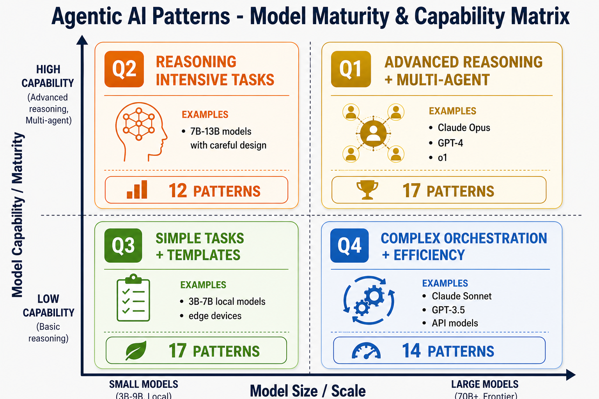

# Agentic AI Patterns Library

**A comprehensive collection of 60+ design patterns, architectures, and techniques for building intelligent AI-powered applications using Large Language Models (LLMs).**

This library provides documented patterns that address the full lifecycle of agentic AI development—from core reasoning strategies to multi-agent coordination, workflow orchestration, knowledge integration, safety mechanisms, and operational reliability.

## 📌 Page Content Index

- [What This Library Offers](#-what-this-library-offers)
- [Getting Started](#-getting-started)
- [🏗️ Systems Layer (Tier-2 Architecture)](#systems-layer-tier-2-architecture)
- [Quick Navigation](#-quick-navigation)
- [Pattern Groups & Comparisons](#-pattern-groups--comparisons)
- [Model Maturity & Capability Matrix](#-model-maturity--capability-matrix)
- [Categories Overview](#categories-overview)
- [Pattern Directory Structure](#-pattern-directory-structure)
- [How to Use This Library](#-how-to-use-this-library)
- [What You'll Find in Each Pattern](#-what-youll-find-in-each-pattern)
- [Library Statistics](#-library-statistics)
- [Academic Foundation](#-academic-foundation)
- [Related Resources](#-related-resources)

## 🎯 What This Library Offers

- **60+ Production Patterns**: Proven design patterns for LLM-powered systems
- **Real-World Architectures**: Multi-agent systems, RAG pipelines, orchestration patterns
- **Academic References**: 32+ arxiv papers, 130+ tools/docs/benchmarks
- **Pattern Relationships**: Clear documentation of pattern similarities, differences, and when to use each
- **Multiple Implementations**: Python code examples and JavaScript/TypeScript usage
- **Complete Explanations**: ASCII diagrams, detailed use cases, tradeoff analysis

## 🚀 Getting Started

Getting started content has moved to [GETTING_STARTED.md](./GETTING_STARTED.md).

### 🏗️ Systems Layer (Tier-2 Architecture)

For system design and pattern composition, see the **[Systems Layer](./systems/)**:
- **[Architectures](./systems/architectures/)** - Composed systems like RAG agents, tool-using workflows
- **[Execution Models](./systems/execution_models/)** - Loop-based, DAG-based, multi-agent paradigms
- **[Compositions](./systems/compositions/)** - Pattern combinations like ReAct + Memory
- **[Decision Guide](./systems/decision/)** - Pattern and architecture selection frameworks
- **[Production Patterns](./systems/production/)** - Reliability, evaluation, observability, optimization

## 🔗 Quick Navigation

### Pattern Groups (Similar Patterns Explained)
For patterns that are similar or overlapping, start with the **Pattern Groups** folder for detailed comparisons:

- **[Evaluation & Improvement Loop](./pattern-groups/evaluation-loop/)** — Judge Evaluator vs Evaluator Optimizer
- **[Task Delegation & Orchestration](./pattern-groups/task-delegation/)** — Orchestrator Workers vs Supervisor vs Hierarchical Team
- **[Sequential & Collaborative Processing](./pattern-groups/sequential-processing/)** — Prompt Chaining vs Round Robin
- **[Request Distribution](./pattern-groups/request-distribution/)** — Router vs Orchestrator
- **[Debate & Consensus](./pattern-groups/debate-consensus/)** — Debate Pattern vs Agent Swarm
- **[Workflow Gates & Approval](./pattern-groups/workflow-gates/)** — Gate Checkpoint vs Human-in-Loop
- **[Standalone Patterns](./pattern-groups/standalone-patterns/)** — Parallelization & Pub-Sub

👉 **Start here if you're choosing between similar patterns!**

## 📚 Pattern Groups & Comparisons

Not sure which pattern to use? Check the **[Pattern Groups README](./pattern-groups/README.md)** for:
- Side-by-side pattern comparisons
- When to use each pattern
- When NOT to use each pattern
- Decision trees for choosing
- Concrete code snippets

## 🧠 Model Maturity & Capability Matrix

Different patterns require different model capabilities. This **4-quadrant matrix** helps you choose patterns based on your model size and capabilities.

### 4-Quadrant Model Capability Map



**Legend:**
- ⭐ **Q1**: Premium Models (Claude Opus, GPT-4) - 17 patterns - Advanced Reasoning + Multi-Agent
- ⚠️ **Q2**: Constrained Design (7B models) - 12 patterns - Reasoning Intensive Tasks
- ✅ **Q3**: Simple & Efficient (Local models) - 17 patterns - Simple Tasks + Templates
- 🚀 **Q4**: Large & Efficient (Sonnet, 3.5) - 14 patterns - Complex Orchestration + Efficiency

## Categories Overview

| Category | Count | Description | Key Use Cases |
|----------|-------|-------------|---|
| **Core Reasoning** | 10 | Step-by-step reasoning strategies for complex problem solving | Math, logic, analysis, decision-making |
| **Agent Architecture** | 11 | Core agent components: tools, memory, state management, planning | Building robust individual agents |
| **Multi-Agent Collaboration** | 8 | Patterns for multiple agents working together | Teams, swarms, hierarchies, debates |
| **Workflow Orchestration** | 11 | Orchestrating multi-step processes and intelligent routing | Pipelines, task distribution, approval flows |
| **RAG & Knowledge Integration** | 6 | Retrieval-augmented generation and knowledge systems | Q&A, document search, context grounding |
| **Output & Safety** | 6 | Structured outputs, validation, and safety guardrails | Data extraction, compliance, safety |
| **Security & Access Control** | 9 | Prompt injection defense, tool permissioning, secrets, sandboxing, audit | Security hardening, compliance, threat prevention |
| **Cost & Efficiency** | 4 | Model routing, caching, context optimization | Cost reduction, latency optimization |
| **Operational Reliability** | 10 | Reliability, cost optimization, caching, observability | Production systems, monitoring, resilience |
| **Advanced Techniques** | 7 | Meta-prompting, self-improvement, simulated environments | Optimization, learning, experimentation |

## 📋 Pattern Directory Structure

All 80+ patterns are organized in the **[patterns/](./patterns/)** directory by category:
- Core Reasoning Patterns
- Agent Architecture Patterns (includes Planner-Worker Separation, Plan-Then-Execute)
- Multi-Agent Collaboration Patterns (includes Sub-Agent Spawning)
- Workflow Orchestration Patterns
- RAG & Knowledge Integration Patterns
- Output & Safety Patterns
- Security & Access Control Patterns (includes Dual LLM, PII Tokenization, Policy-Gated Proxy)
- Cost & Efficiency Patterns (NEW - Budget Routing, Action Caching, Context Compaction)
- Operational Reliability Patterns (includes Circuit Breaker, Observability)
- Advanced Techniques

Each pattern folder contains a detailed README with implementation examples, use cases, and academic references.

## 💻 How to Use This Library

### Option 1: Browse Patterns Online

Each pattern has a **README.md** with:
- ✅ Detailed explanation of what it does
- ✅ ASCII diagrams showing the architecture
- ✅ Real-world examples
- ✅ When to use (and when NOT to use)
- ✅ Academic references (5-10 papers)

**Example**: To understand Chain-of-Thought:
```
./patterns/chain-of-thought/
├── README.md          ← Start here for explanation
├── code.py            ← Python implementation
└── example.js         ← JavaScript usage
```

### Option 2: Review Pattern Groups & Comparisons

For patterns that are similar:
```bash
# Navigate to pattern groups
./pattern-groups/
├── evaluation-loop/           # Judge vs Evaluator-Optimizer
├── task-delegation/           # Orchestrator vs Supervisor vs Hierarchical
├── sequential-processing/     # Chaining vs Round-Robin
├── request-distribution/      # Router vs Orchestrator
├── debate-consensus/          # Debate vs Swarm
├── workflow-gates/            # Gate vs Human-in-Loop
└── README.md                   # Start here for decision guide
```

Each group has:
- Side-by-side comparison tables
- Decision trees ("should I use A or B?")
- Tradeoff analysis
- Code examples
- Anti-patterns (when NOT to use)

### Option 3: Find by Use Case

What do you want to build?

| Goal | Patterns | Start Here |
|------|----------|-----------|
| Answer questions from documents | RAG | [Basic RAG](./patterns/basic-rag/README.md) → [Advanced RAG](./patterns/advanced-rag/README.md) |
| Multi-agent team | Collaboration | [Supervisor](./patterns/supervisor-pattern/README.md) or [Hierarchical Team](./patterns/hierarchical-team/README.md) |
| Complex workflows | Orchestration | [Prompt Chaining](./patterns/prompt-chaining/README.md) → [Orchestrator](./patterns/orchestrator-workers/README.md) |
| Multi-step reasoning | Reasoning | [Chain-of-Thought](./patterns/chain-of-thought/README.md) → [ReAct](./patterns/react/README.md) |
| Reliable production | Operational | [Retry Backoff](./patterns/retry-backoff/README.md) + [Circuit Breaker](./patterns/circuit-breaker/README.md) + [Observability](./patterns/observability-tracing/README.md) |
| Safe AI systems | Safety | [Guardrails](./patterns/guardrails-pattern/README.md) + [Gate Checkpoint](./patterns/gate-checkpoint/README.md) + [Human-in-Loop](./patterns/human-in-the-loop/README.md) |

### Option 4: Import Code Examples

Each pattern includes Python and JavaScript implementations:

```python
# Python
from patterns.chain_of_thought import ChainOfThought
cot = ChainOfThought()
result = cot.execute("What is 23 * 47?")
```

```javascript
// JavaScript/TypeScript
import { ChainOfThought } from './patterns/chain-of-thought/example.js';
const cot = new ChainOfThought();
const result = await cot.execute("What is 23 * 47?");
```

## 📖 What You'll Find in Each Pattern

Every pattern folder contains:

```
pattern-name/
├── README.md                          # Complete explanation
│   ├── What it does
│   ├── When to use (and when NOT to)
│   ├── ASCII diagrams
│   ├── Real-world examples
│   ├── 5-10 academic references
│   └── Related links
│
├── code.py                            # Python implementation
│
└── example.js                         # JavaScript/TypeScript example
```

## 📊 Library Statistics

- **Total Patterns**: 60+
- **Categories**: 8
- **Academic References**: 32+ arxiv papers, 130+ tools/docs/benchmarks
- **Pattern Types**:
  - Foundational: 20 patterns
  - Intermediate: 22 patterns
  - Emerging (newer, experimental): 6 patterns
  - Advanced (specialized, complex): 4+ patterns
- **Implementation Examples**: Python + JavaScript for each pattern

## 🔭 Academic Foundation

This library is grounded in extensive research and resources, with 168 references including:
- Academic papers (32+ arxiv publications)
- Tools and frameworks (LangChain, AutoGen, CrewAI, etc.)
- Documentation and guides (OpenAI, Anthropic, etc.)
- Benchmarks and evaluation platforms

See [REFERENCE_MATERIALS.md](./REFERENCE_MATERIALS.md) for the complete list.

## 🔗 Related Resources

- [Pattern Groups Index](./pattern-groups/README.md) - Start here for decision guides
- [Patterns Index](./patterns/README.md) - Complete reference of all patterns
- [Systems Layer](./systems/README.md) - Tier-2 architecture and composition patterns
- [Reference Materials](./REFERENCE_MATERIALS.md) - Complete list of 168 papers, tools, and resources
- [GETTING_STARTED.md](./GETTING_STARTED.md) - Getting started guide

---
*From [Yashodhan Kholgade](https://github.com/kholgade/agentic_ai_patterns_reference) (2026)*